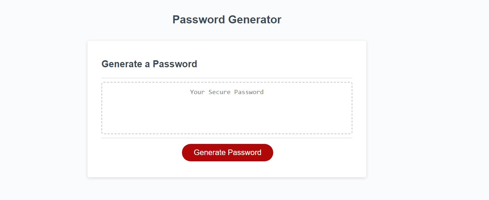
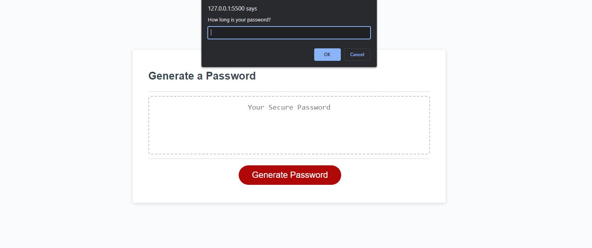
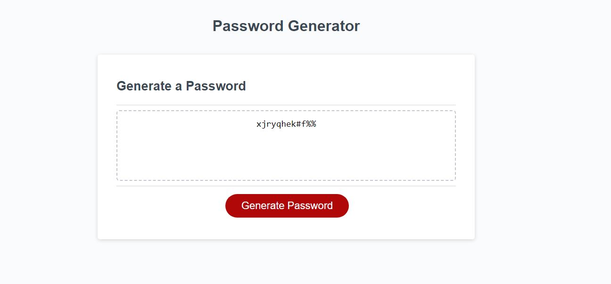

# password-creator

### License
  
***

## Description
This is an application the allows users to generate a random password including numbers,symbols,uppercase/lowercase letters. The user will have the option to exclude any of the above options. If none of the options are selected the user will be given a password with all lower case letters.
***

## Table of Contents
1. [Technologies Used](#technologies)
2. [Screenshots](#screenshots)
3. [Links](#links)
***

## Technologies Used
  
* HTML

* JavaScript

*CSS

***

## Screenshots

***

## Links

[Deployed-Application](https://primary-keys-rentals.herokuapp.com/)

[Repo-Link](https://github.com/TottoMoe/PrimaryKeysRentals)
***